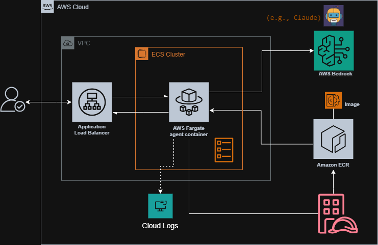

# Bedrock-Agent-on-ECS - CDK-Deployment
---

## Purpose

**Deploy Bedrock AgentCore application to AWS ECS Fargate using AWS CDK python. The agent uses default (claude) model and is accessible via ALB.**

---

**Key features**

- 🚀 Single command deployment (`cdk deploy`)
- 🤖 AI agent powered by Amazon Bedrock (Claude)
- 🐳 Containerized with Docker
- ⚖️ Load balanced with Application Load Balancer
- 📊 CloudWatch logging for monitoring
- 🔒 IAM roles with least privilege
- 🏗️ IaC with AWS CDK

## Design



---

## Architecture

```
User Request (HTTP POST)
    ↓
Application Load Balancer
    ↓
ECS Fargate Service (Port 8080)
    ↓
Agent Container (/invocations endpoint)
    ↓
Amazon Bedrock (Claude Model)
```

---

## Prerequisites

- AWS Account with CLI configured
- AWS CDK CLI installed (`npm install -g aws-cdk`)
- Docker installed and running
- Python 3.11+
- [CDK](https://docs.aws.amazon.com/cdk/v2/guide/getting-started.html)

---

### 1. Clone and Setup

```bash
# Navigate to project
cd Bedrock-Agent-on-ECS-CDK-Deployment
# Install CDK dependencies
cd cdk
python -m venv .venv
source .venv/bin/activate  # Windows: .venv\Scripts\activate
pip install -r requirements.txt
```

### 2. Deploy

```bash
cdk deploy
```

**Deployment takes 5-10 minutes.** CDK will:
- Build Docker image from `agent/` directory
- Push image to ECR
- Create VPC, ECS, ALB, SG, IAM roles
- Deploy container to Fargate
- Output the ALB URL (for invoking)

### 3. Test Your Agent

```bash
# Get ALB URL from CDK output
export ALB_URL="<your-alb-url-from-output>"

# Test the agent
curl -X POST http://$ALB_URL/invocations \
  -H "Content-Type: application/json" \
  -d '{"prompt": "Hello"}'
```

**Expected Response:**
```json
{
  "result": {
    "role": "assistant",
    "content": [
      {
        "text": "Hello! How can I assist you today?"
      }
    ]
  }
}
```

---

## 4. Cleanup

```bash
cd cdk
cdk destroy
```

### 5. future work
- Add https
- vertical scaling
- Custom domain
- Add tools
- monitoring
- CI/CD
- Multi-environment